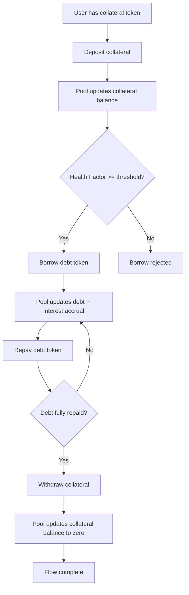

# Task 5 Report — Lending Protocol Simulation

## Objective
Implement a simplified lending protocol with collateral deposit, borrowing, repayment, withdrawal constraints, interest accrual, and liquidation.

## What was implemented
- `src/LendingPool.sol`
  - `deposit`
  - `borrow`
  - `repay`
  - `withdraw`
  - `liquidate`
  - `healthFactor`
  - `currentBorrowBalance`
- Position tracking for deposited collateral, borrowed debt, and accrual timestamp.
- LTV constraint (max 75%).
- Linear time-based interest accrual model.
- Liquidation path for undercollateralized accounts.

## Test coverage summary
- Unit tests in `test/unit/LendingPool.t.sol` include:
  - deposit/withdraw flow
  - borrow within and beyond LTV
  - partial/full repay
  - liquidation after simulated price drop
  - interest accrual with `vm.warp`
  - edge cases and revert paths

## Workflow diagram
Provide a workflow diagram for:
`deposit -> borrow -> repay -> withdraw`.

## Evidence placeholders
- `[INSERT SCREENSHOT: LendingPool tests passing output]`
- `[INSERT SCREENSHOT: LendingPool gas report section]`
- `[INSERT WORKFLOW DIAGRAM IMAGE/PDF HERE]`
- `[INSERT LOG EXCERPT: liquidation and interest-accrual test output]`

## Commands to capture each screenshot
Run from project root:

```bash
cd Project
export PATH="$HOME/.foundry/bin:$PATH"
mkdir -p artifacts/logs/forge artifacts/docs
```

1. **LendingPool tests passing output**
```bash
forge test --match-path test/unit/LendingPool.t.sol -vv | tee artifacts/logs/forge/task5-lending-tests.log
```

2. **LendingPool gas report section**
```bash
forge test --match-path test/unit/LendingPool.t.sol --gas-report | tee artifacts/logs/forge/task5-lending-gas.log
```

3. **Workflow diagram (deposit -> borrow -> repay -> withdraw)**
Use Mermaid Live Editor: `https://mermaid.live`



Export as PNG/SVG and save to:
```bash
artifacts/docs/screen\ 3.svg
```

4. **Liquidation + interest-accrual log excerpt**
```bash
forge test --match-path test/unit/LendingPool.t.sol --match-test "test(InterestAccruesOverTime|LiquidationAfterPriceDrop).*" -vv | tee artifacts/logs/forge/task5-lending-focus.log
grep -E "Interest|Liquidation|PASS|Ran" artifacts/logs/forge/task5-lending-focus.log
```
